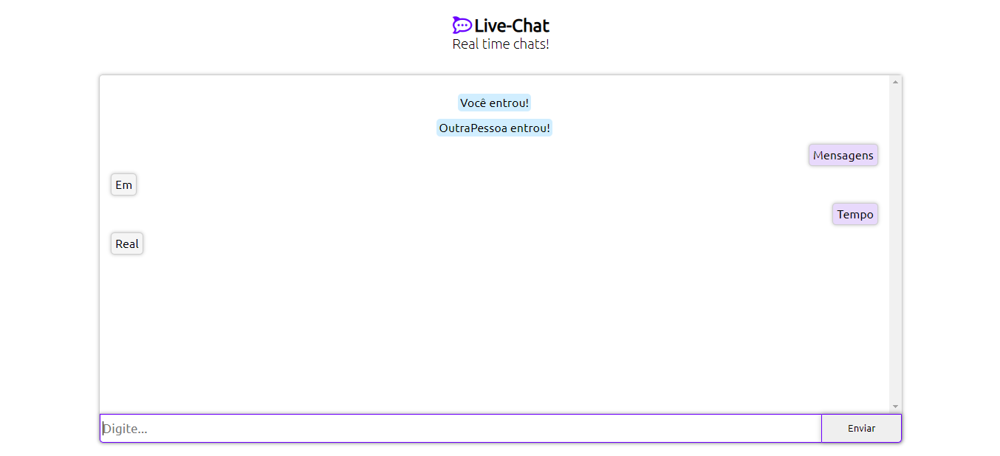

<h1 align="center">
    
    Live-Chat
</h1>

  <a href="#tecnologias">Tecnologias</a>&nbsp;&nbsp;&nbsp;|&nbsp;&nbsp;&nbsp;
  <a href="#projeto">Projeto</a>&nbsp;&nbsp;&nbsp;|&nbsp;&nbsp;&nbsp;

 

  

## Tecnologias

Principais tecnologias usadas no desenvolvimento:

- [Node.js](https://nodejs.org/en/)
- [Express](https://expressjs.com/)
- [socket.io](https://socket.io/)

## Projeto

Live-Chat é um simples app desenvolvido em nodejs juntamente com express e socket.io para criar bate-papos em tempo ral com outras pessoas.

---

by Miguel Ângelo.